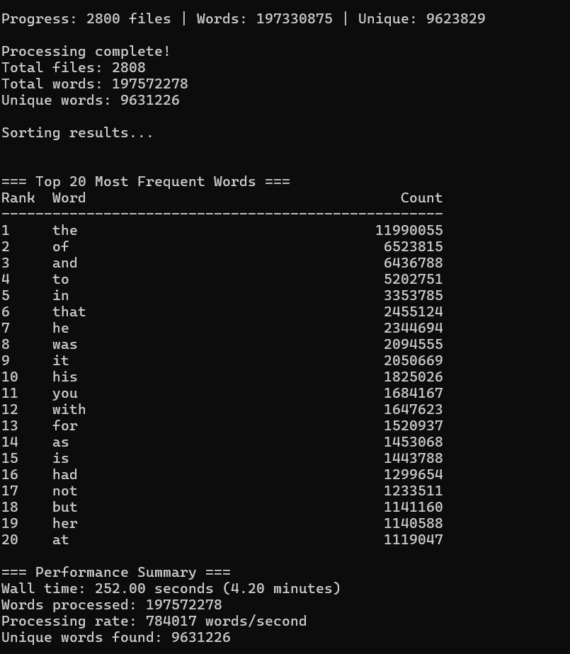

Parallel Programming Assignment - Week 13

Example_01: Sequential Word Count

-Description:  
This example counts all words in the dataset sequentially, file by file, using a single process.  

Dataset path:
`C:\Users\Nadja Milanovic\Downloads\dataset_for_map_reduce\D1.7GB`

Output Screenshot:

Results from run:  
-Total files: 2808  
-Total words: 197,572,278  
-Unique words: 9,631,226  
-Wall time: 4.20 minutes  
-Top 20 most frequent words: `the, of, and, to, in, that, he, was, it, his, you, with, for, as, is, had, not, but, her, at`

Example_02: Parallel Word Count (MPI)

Description:
This example would count words in parallel using MPI and MapReduce. Each process would handle a subset of files, then results would be combined.  
-Expected behavior: Faster execution, especially with multiple processes.  
-Example run commands:  

mpicc -O3 mpi_wordcount.c -o wordcount
mpirun -np 2 wordcount "C:\Users\Radinka Popovic\Downloads\dataset_for_map_reduce\D1.7GB"
mpirun -np 4 wordcount "C:\Users\Radinka Popovic\Downloads\dataset_for_map_reduce\D1.7GB"
mpirun -np 8 wordcount "C:\Users\Radinka Popovic\Downloads\dataset_for_map_reduce\D1.7GB"

*Note:
Due to installation issues with MPI on Windows, I was unable to run this example.
If it had run, the output would have included:
Same total words and unique words as the sequential run
Wall time significantly reduced with increasing number of processes
Top 20 words identical to sequential results

Sequential version processes files one by one.
Parallel version splits the dataset among multiple processes using MapReduce.
As the number of processes increases, wall time decreases until limited by CPU or I/O bandwidth.
Both produce the same word counts and top words; only performance differs.

-Conclusion:

Example_01 successfully ran and counted all words.
Example_02 could not be executed due to MPI setup issues, but the expected behavior and performance improvements are explained.
Screenshot of sequential run included as proof of functionality.