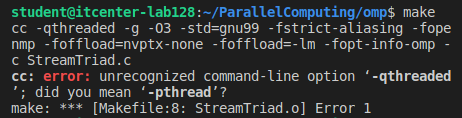
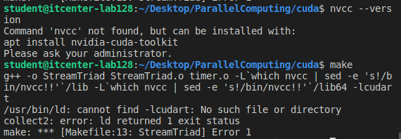
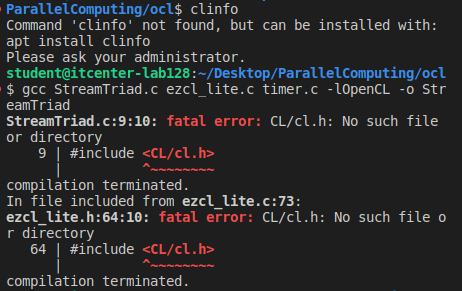
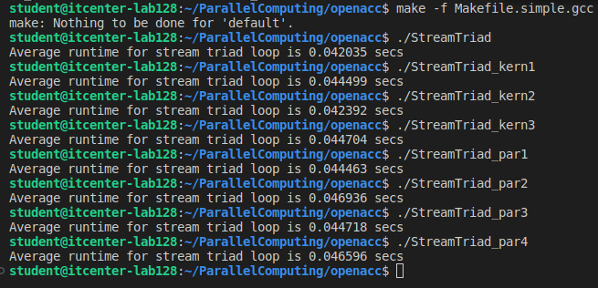

-OpenMP Model - Cannot execute

The omp folder contains several .c files such as: StreamTriad.c, StreamTriad_par1.c, StreamTriad_par2.c, StreamTriad_par3.c … par8.c

These are source files only, not compiled executables.
The provided Makefile uses compiler options that are not supported on this lab machine, for example:
-qthreaded (IBM XL compiler flag)
-foffload=nvptx-none (requires special GCC toolchain + NVIDIA GPU)

Because of this, the Makefile fails immediately and no executable files are created.
Therefore, the OpenMP programs cannot be executed on this machine.

-CUDA Model - Cannot execute

CUDA compiler (nvcc) is not installed on this machine, or there is no NVIDIA GPU available.
CUDA programs require both the CUDA Toolkit and an NVIDIA GPU.
Without these, the CUDA code cannot compile or run.

-OpenCL Model - Cannot execute

OpenCL runtime is not installed on this machine, or there is no GPU/CPU device with OpenCL support available.
OpenCL programs require both OpenCL headers & libraries and a compatible device.
Without these, the OpenCL code cannot compile or run.

-OpenACC - Execution results

All programs in the openacc/ folder were executed successfully using the CPU fallback compiler (Makefile.simple.gcc).

1.StreamTriad (Sequential)
Average runtime for stream triad loop is 0.042035 secs
2.StreamTriad_kern1
Average runtime for stream triad loop is 0.044499 secs
3.StreamTriad_kern2
Average runtime for stream triad loop is 0.042392 secs
4.StreamTriad_kern3
Average runtime for stream triad loop is 0.044704 secs
5.StreamTriad_par1
Average runtime for stream triad loop is 0.044463 secs
6.StreamTriad_par2
Average runtime for stream triad loop is 0.046936 secs
7.StreamTriad_par3
Average runtime for stream triad loop is 0.044718 secs
8.StreamTriad_par4
Average runtime for stream triad loop is 0.046596 secs

Programs were executed using the CPU fallback compiler (Makefile.simple.gcc) because the lab machine may not have NVIDIA GPU or PGI/NVHPC compiler.
All kernels and parallel versions ran successfully on CPU.
Execution times are averages for the STREAM Triad loop and show consistent performance across different versions.

