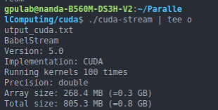
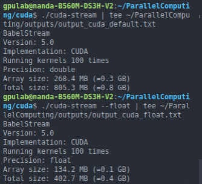
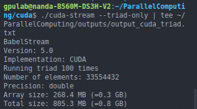

ParallelComputing Benchmark - Babel STREAM
Overview

-This project is about running Babel STREAM benchmarks for different programming models. I tested:
CPU using OpenMP (1, 2, 4 threads)
GPU using CUDA (dGPU)
iGPU 

1.CPU Benchmark - OpenMP

I ran the benchmark with different OMP threads. Results are in outputs/omp_scaling.txt.

Observations:
Performance improves when using more threads.
Dot kernel scales the most.
Copy, Mul, Add, and Triad scale a little slower.

2.GPU Benchmark - CUDA

I connected to the lab server (gpulab@10.1.8.100) and ran CUDA benchmarks. Results are in outputs/output_cuda_default.txt.

Implementation: CUDA
Precision: double
Array size: 268.4 MB (~0.3 GB)
Total size: 805.3 MB (~0.8 GB)

Observations:
CUDA runs much faster than CPU OpenMP.
Float uses smaller memory (~134 MB per array), which can improve speed.
Triad-only test is fast and useful to check bandwidth.

-Comparison/Observations:
CPU vs GPU: GPU is much faster, especially for the Dot kernel.
iGPU vs GPU: iGPU would be slower than GPU but faster than CPU.
Memory: Float arrays use half memory of double arrays, which can improve bandwidth and reduce runtime.

