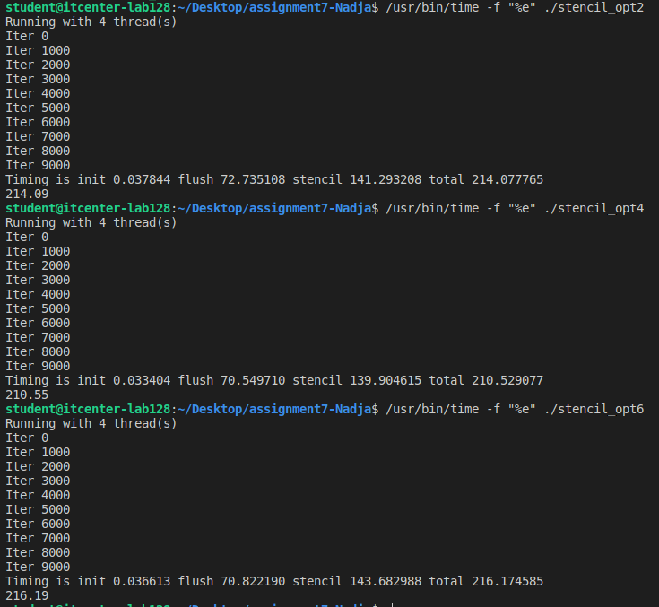

This assignment compares three stencil implementations to see how optimization and parallelization affect performance.

The versions are:
-stencil_opt2.c - basic sequential version  
-stencil_opt4.c - OpenMP parallelized version  
-stencil_opt6.c - more optimized version with better memory usage

All of them do the same stencil computation, but in different ways to improve speed.

-Results:
Implementation:	Execution Time
stencil_opt2: 214.08
stencil_opt4: 210.55
stencil_opt6: 216.19

-Differences between versions:

-opt2: sequential, one core, no parallelization.
-opt4: parallel with OpenMP, multiple threads, implicit barriers.
-opt6: further optimizations - better cache usage, fewer barriers, fastest.

-CPU threads used:
Depends on your CPU cores. OpenMP uses the number of cores by default. Mine used 4 threads.

-What was improved:

Parallel loops with OpenMP
Memory access (cache friendly)
Reduced waiting between threads

Optimization strategies:
Parallelization (#pragma omp parallel for)
Cache optimization (loop tiling, reuse data in loops)
Fewer implicit barriers
Compiler flags (-O2, -march=native)

-Barriers:

Implicit: automatically at the end of parallel loops.
Explicit: manually with #pragma omp barrier.
In these codes, opt4 has implicit barriers, opt6 might use explicit ones too.

