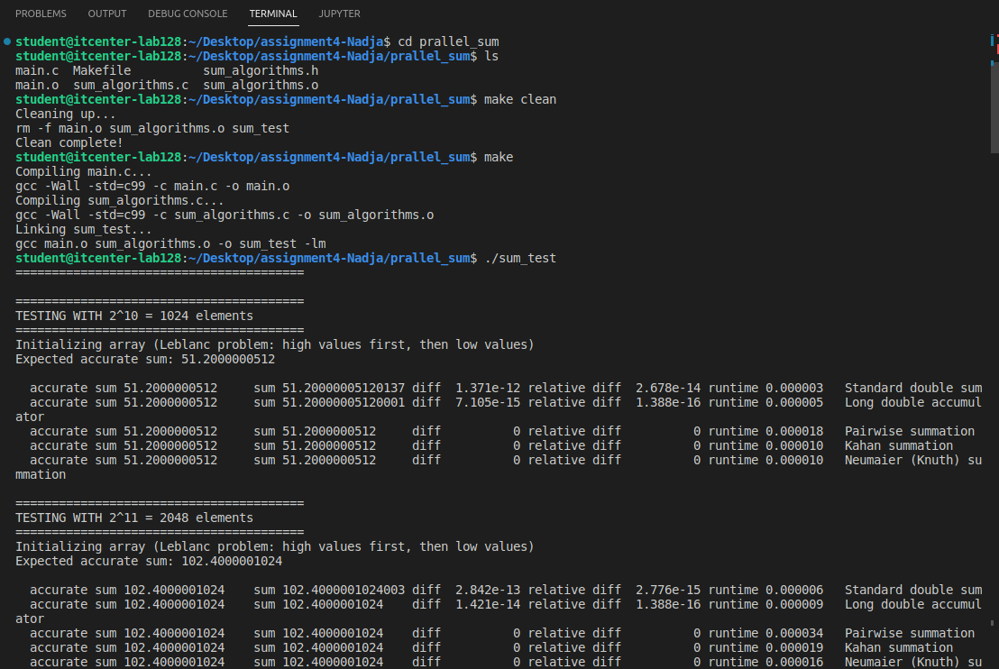

Project description:

This project checks a few different ways to sum a lot of floating-point numbers.
It shows how rounding errors can appear when we add many numbers, and how some better methods can make the result more accurate.

How the code works:

The program makes arrays with sizes from 2^10 (1024) up to 2^27 (134,217,728) elements.
Each array has half big values (0.1) and half very small values (0.1 / 1e9). This causes the global sum problem.
The program knows what the correct sum should be.

For every method it:
-Runs the summation function
-Measures how long it takes
-Checks how far the result is from the correct one
-Prints the error and runtime

Implemented algorithms:
All the algorithms are in the file sum_algorithms.c.

Here is what each one does:
Standard double sum - normal summation using a simple for loop
Long double accumulator - same as above, but uses a higher precision variable
Pairwise summation - adds numbers in pairs, which helps reduce rounding errors
Kahan summation - keeps track of small lost bits from rounding and adds them back
Neumaier (Knuth) summation - similar to Kahan but even more stable in some situations

Why some techniques are more accurate:

When we add large and small numbers in floating-point format, small ones can disappear, because the computer cannot store all digits and thats called loss of precision.

Better algorithms fix this by:

-Adding numbers more carefully
-Keeping small corrections
-Reducing how much rounding builds up
Because of that, the result is much closer to the true value.

The global sum problem and parallelization:

In parallel programs, we often split the array between threads so they all add parts of it.
But since floating-point addition is not associative which means (a + b) + c can be slightly different from a + (b + c),
the final sum can change depending on the order the threads combine results.
That’s why this is called the global sum problem, even with the same data, results can differ slightly in parallel programs.
Using more accurate methods like Kahan or Pairwise helps make this problem smaller.

Result spreadsheet: https://docs.google.com/spreadsheets/d/1fZs9h5KD18kW8rj4eRaB3svxLs6y_iRPijL5Ch-w5s4/edit?usp=sharing