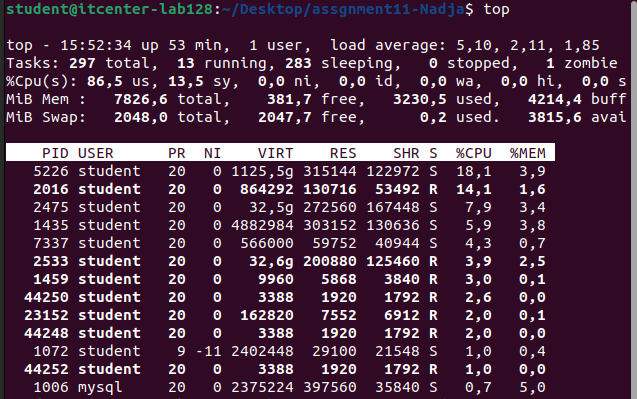
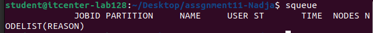
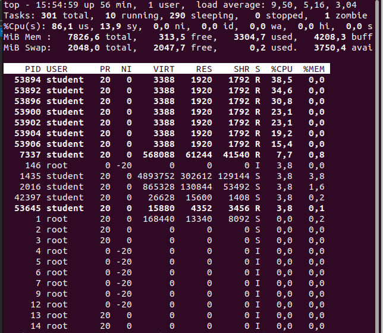
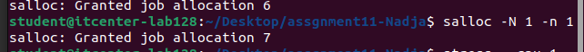

Parallel Computing Assignment Week 11

Running compute.sh
Commands:
bash compute.sh

Screenshots:

top: 
squeue: 

Explanation:

-The script uses all available threads (4) on the node
-CPU usage is high (~86%) while the job runs
-squeue is empty because jobs finish quickly

Running overload.sh with sbatch
Commands:
sbatch overload.sh

Screenshots:

top: 
squeue: 

Explanation:

-Using sbatch, Slurm controls job scheduling
-If threads are busy, jobs wait in queue
-Prevents CPU overload and ensures controlled execution

Running overload.sh directly (without scheduler)
Commands:
bash overload.sh

Result:

-Jobs use all CPU immediately - possible performance drop
-Jobs execute in parallel without control - may take longer
-Final output may be the same, but without scheduler, execution is less controlled

salloc tests

Commands and results:
salloc -N 1 -n 1 - 1 thread, minimal CPU load
salloc -N 1 -n 2 - 2 threads, ~50% CPU load
salloc -N 1 -n 4 - 4 threads, 100% CPU load

Explanation:

-Number of threads directly affects CPU usage and job duration
-More threads - shorter execution time but higher CPU load

Notes about cores/threads:

-Taken from sudo slurmd -C
-Node has 4 threads (2 cores x 2 threads/core)
-Scripts are configured to use all available threads