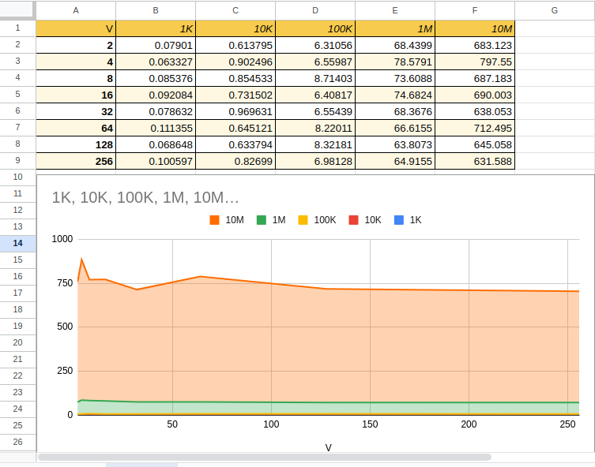

AoSoA Performance Measurement

Overview:
In this project I tested how the AoSoA data layout performs when we change the vector length V and the array size N. The goal was to see how different memory layouts and vectoriyation affects the speed of simple data operations in C++.

Run tests using:
make test_1K
make test_10K
make test_100K
make test_1M
make test_10M

Each command runs the code for a specific number of elements N and generates a CSV file, for example:"results_N1000.csv".

The Makefile automatically compiles the code for several vector sizes and runs all tests.
Results were visualized in  a graph which you can see in the the Google Sheets link:https://docs.google.com/spreadsheets/d/1F_ip2Y1b3HuzqoTZ-7NcfBlGnFLeUmdHQ1EuwAPiKpA/edit?usp=sharing

By looking at the graph, you can notice that as V gets larger, total vector execution time usually goes down, that means that the program runs faster.
This happens because larger vectors make better use of memory and the CPUs vector instructions.
For smaller arrays, there is almost no difference because everything fits in cache, but when arrays get big, using higher V values will help reduce total processsing time until it eventually evens out.