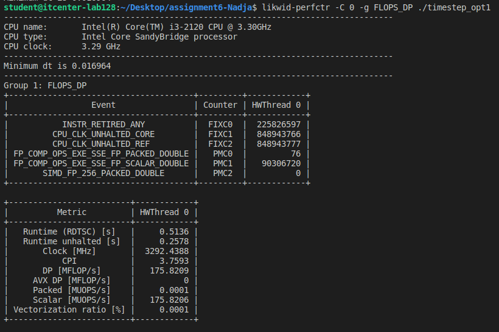
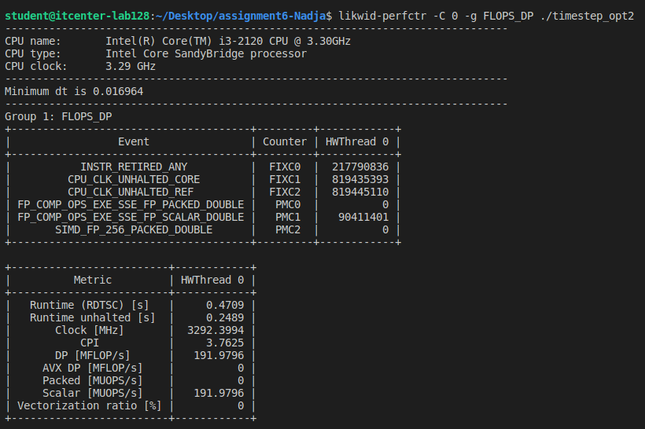
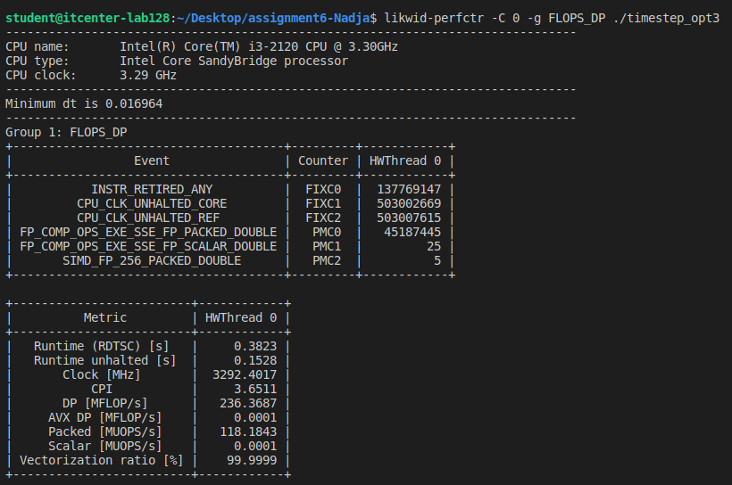

-Parallel Programming: Vectorization Lab

-I compiled three versions of the program with optimizations and OpenMP:

student@itcenter-lab128:~/Desktop/assignment6-Nadja$ gcc -O3 -march=native -fopenmp -fopt-info-vec=vec_info_opt1.txt \
    main.c timestep_opt1.c -lm -o timestep_opt1 
student@itcenter-lab128:~/Desktop/assignment6-Nadja$ gcc -O3 -march=native -fopenmp -fopt-info-vec=vec_info_opt2.txt \
    main.c timestep_opt2.c -lm -o timestep_opt2 
student@itcenter-lab128:~/Desktop/assignment6-Nadja$ gcc -O3 -march=native -fopenmp -fopt-info-vec=vec_info_opt3.txt \
    -fno-trapping-math -fno-math-errno \
    main.c timestep_opt3.c -lm -o timestep_opt3 

-O3-max optimization
-march=native-use CPU features
-fopenmp-enable OpenMP
-fopt-info-vec-generate vectorization report
-fno-trapping-math -fno-math-errno (for opt3)-allow full math optimizations

-Running the programs:

student@itcenter-lab128:~/Desktop/assignment6-Nadja$ ./timestep_opt1
Minimum dt is 0.016964
student@itcenter-lab128:~/Desktop/assignment6-Nadja$ ./timestep_opt2
Minimum dt is 0.016964
student@itcenter-lab128:~/Desktop/assignment6-Nadja$ ./timestep_opt3
Minimum dt is 0.016964

-All versions give the same result:Minimum dt is 0.016964

-In opt1 I added basic OpenMP parallelization and minor loop reorganizations to allow the compiler to vectorize some operations.

-In opt2 I added moving variables inside the loop and better memory access patterns to improve vectorization efficiency.

-In opt3 I added restrict keywords, pragma directives, and allowed unsafe math (-fno-trapping-math) to enable full vectorization and maximize performance.

-Performance (LIKWID)
opt1: scalar, slowest (~0.51 s)
opt2: minor improvements (~0.47 s)
opt3: fully vectorized (~0.38 s, 99.9% vectorization)

-Compiler vectorization reports:
-opt1: no vectorization (scalar)
-opt2: partial vectorization
-opt3: fully vectorized (uses SIMD, pragma reduction, restrict, -fno-trapping-math)

-Conclusion:
-All versions produce the same result.
-Opt3 is the fastest and fully vectorized.
-Key improvements: moving variables inside the loop + allowing unsafe math (-fno-trapping-math).