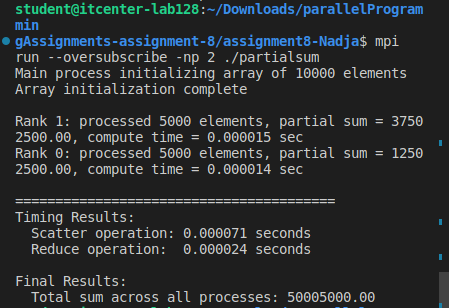
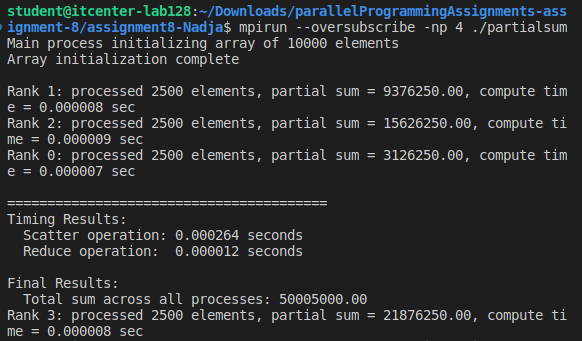
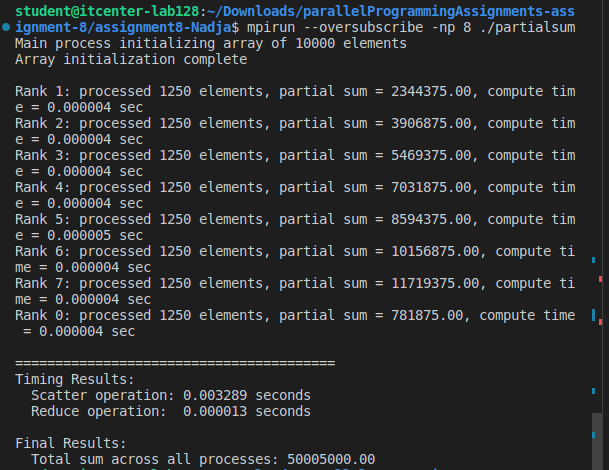

Lab 8: MPI Partial Sum

I used MPI to split a big array between multiple processes.
Rank 0 creates and initializes the array of 10000 elements.
The array is divided using MPI_Scatterv so that each process gets a part.
Each process calculates its local sum.
Then all local sums are combined using MPI_Reduce to get the total sum on rank 0.
I measured time for scatter and reduce operations using a simple timer.

1.Scatter: sends different parts of the array to each process.
2.Local sum: each process calculates sum of its part.
3.Reduce: all local sums are added together into total_sum on rank 0.

-Results:

2 processes:

4 processes:

8 processes:

-Notes:
I used --oversubscribe because the computer has fewer CPU cores than the number of processes.
Partial sums are printed by each rank to show how the array was split.
